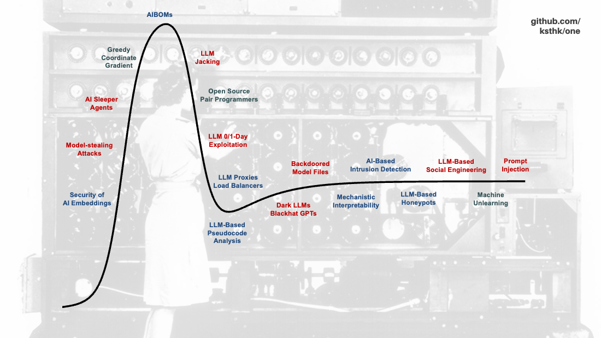

# **Awesome List of Cybersecurity and AI**

Below a so-called *awesome list* with background reading accompanying my talk *AI in Offensive and Defensive Cyber* at the 2024 One Conference in The Hague. The Hype Cycle section aggregates core themes, the other sections provide for further exploration of specific topics.  

## Hype Cycle

- Security of AI Embeddings
    - [Common Pitfalls To Avoid When Using Vector Databases](https://dagshub.com/blog/common-pitfalls-to-avoid-when-using-vector-databases/)
    - [A look at the Pinecone vector database from a privacy, security, and risk management perspective](https://ironcorelabs.com/vectordbs/pinecone-security/)
- Model-stealing Attacks
    - [Stealing Part of a Production Language Model](https://arxiv.org/abs/2403.06634)
- AI Sleeper Agents
    - [Two-faced AI language models learn to hide deception](https://www.nature.com/articles/d41586-024-00189-3)
    - [Sleeper Agents: Training Deceptive LLMs that Persist Through Safety Training](https://arxiv.org/abs/2401.05566)
- Greedy Coordinate Gradient
    - [Accelerating Greedy Coordinate Gradient via Probe Sampling](https://arxiv.org/abs/2403.01251)
    - [Boosting Jailbreak Attack with Momentum](https://arxiv.org/abs/2405.01229)
- AI Bill of Materials (AIBOMs)
    - [Manifest AIBOM (MLBOM) Wiki](https://github.com/manifest-cyber/aibom)
    - [Trail of Bits' response to the US Army’s RFI on developing AIBOM tools](https://blog.trailofbits.com/2024/02/28/our-response-to-the-us-armys-rfi-on-developing-aibom-tools-2/)
- LLM Jacking
    - [LLMjacking: Stolen Cloud Credentials Used in New AI Attack](https://sysdig.com/blog/llmjacking-stolen-cloud-credentials-used-in-new-ai-attack/)
- Open Source Pair Programmers
    - [Devon: An open-source pair programmer](https://github.com/entropy-research/Devon)
- LLM 0/1-Day Exploitation
    - [No, LLM Agents can not Autonomously Exploit One-day Vulnerabilities](https://struct.github.io/auto_agents_1_day.html)
    - [Project Naptime: Evaluating Offensive Security Capabilities of Large Language Models](https://googleprojectzero.blogspot.com/2024/06/project-naptime.html)
- LLM Proxies and Load Balancers
    - [LiteLLM](https://github.com/BerriAI/litellm)
    - [Networking The AI Data Center](https://www.juniper.net/content/dam/www/assets/white-papers/us/en/networking-the-ai-data-center.pdf)
- LLM-Based (Malware) Pseudocode Analysis
    - [MALSIGHT: Exploring Malicious Source Code and Benign Pseudocode for Iterative Binary Malware Summarization](https://arxiv.org/abs/2406.18379)
    - [Large Language Models for Malware Analysis](https://bit-ml.github.io/blog/post/large-language-models-for-malware-analysis/)
- Dark LLMs and Blackhat GPTs
    - [Malla: Demystifying Real-world Large Language Model Integrated Malicious Services](https://arxiv.org/abs/2401.03315)
- Backdoored Model Files
    - [Data Scientists Targeted by Malicious Hugging Face ML Models with Silent Backdoor](https://jfrog.com/blog/data-scientists-targeted-by-malicious-hugging-face-ml-models-with-silent-backdoor/)
    - [Model Files are Invisible Viruses](https://protectai.com/threat-research/model-files-are-invisible-viruses)
- Mechanistic Interpretability
    - [Mapping the Mind of a Large Language Model](https://www.anthropic.com/news/mapping-mind-language-model)
    - [Mechanistic Interpretability for AI Safety - A Review](https://arxiv.org/abs/2404.14082)
    - [Logit Prisms: Decomposing Transformer Outputs for Mechanistic Interpretability](https://neuralblog.github.io/logit-prisms/)
- AI-Based Intrusion Detection
    - [Outside The Closed World: On Using Machine Learning for Network Intrusion Detection](https://oakland10.cs.virginia.edu/slides/anomaly-oakland.pdf)
    - [IDS-ML: Intrusion Detection System Development Using Machine Learning](https://github.com/Western-OC2-Lab/Intrusion-Detection-System-Using-Machine-Learning)
- LLM-Based Honeypots
    - [LLM in the Shell: Generative Honeypots](https://arxiv.org/abs/2309.00155)
    - [Galah: LLM-powered web honeypot designed to mimic various applications](https://github.com/0x4D31/galah)
- LLM-Based Social Engineering
    - [Disrupting deceptive uses of AI by covert influence operations](https://openai.com/index/disrupting-deceptive-uses-of-AI-by-covert-influence-operations/)
    - [AI Will Increase the Quantity—and Quality—of Phishing Scams](https://www.schneier.com/academic/archives/2024/06/ai-will-increase-the-quantity-and-quality-of-phishing-scams.html)
    - [Digital Deception: Generative Artificial Intelligence in Social Engineering and Phishing](https://arxiv.org/abs/2310.13715)
- Machine Unlearning
    - [Verifying in the Dark: Verifiable Machine Unlearning by Using Invisible Backdoor Triggers](https://ieeexplore.ieee.org/document/10298847)
    - [Backdoors Against Natural Language Processing: A Review](https://ieeexplore.ieee.org/document/9841511)
    - [Machine Unlearning in 2024](https://ai.stanford.edu/~kzliu/blog/unlearning)
- Prompt Injection
    - [LLMs’ Data-Control Path Insecurity](https://cacm.acm.org/opinion/llms-data-control-path-insecurity/)
    - [Hacking Google Bard - From Prompt Injection to Data Exfiltration](https://embracethered.com/blog/posts/2023/google-bard-data-exfiltration/)
    - [Prompt Injection Defenses](https://github.com/tldrsec/prompt-injection-defenses)

---

## Policies

- [What policy makers need to know about AI (and what goes wrong if they don’t)](https://www.answer.ai/posts/2024-06-11-os-ai.html)
- [NCSC-NL: The future of cyber attacks with Large Language Models](https://www.ncsc.nl/documenten/publicaties/2024/mei/21/index)
- [The EU Artificial Intelligence Act](https://artificialintelligenceact.eu/)
- [The EU AI Act: National Security Implications](https://cetas.turing.ac.uk/publications/eu-ai-act-national-security-implications)
- [NCSC-UK: Cyber security risks to artificial intelligence: findings](https://www.gov.uk/government/publications/research-on-the-cyber-security-of-ai/cyber-security-risks-to-artificial-intelligence#findings-of-the-risk-assessment)
- [NCSC-UK: Guidelines for secure AI system development](https://www.ncsc.gov.uk/collection/guidelines-secure-ai-system-development)
- [National Security Agency (NSA): Deploying AI Systems Securely: Best Practices for Deploying Secure and Resilient AI Systems](https://media.defense.gov/2024/Apr/15/2003439257/-1/-1/0/CSI-DEPLOYING-AI-SYSTEMS-SECURELY.PDF)
- [Australian Government: Policy for the responsible use of AI in government](https://www.digital.gov.au/sites/default/files/documents/2024-08/Policy%20for%20the%20responsible%20use%20of%20AI%20in%20government%20v1.1.pdf)
- [AI Safety Ethics & Society: Safe Design Principles](https://www.aisafetybook.com/textbook/safe-design-principles)
- [Verzamelbrief AI en Algoritmes](https://www.rijksoverheid.nl/documenten/kamerstukken/2024/06/06/verzamelbrief-ai-en-algoritmes)
- [RDI (NL): Toezicht op kunstmatige intelligentie](https://www.rdi.nl/onderwerpen/kunstmatige-intelligentie/toezicht-op-kunstmatige-intelligentie)
- [Monetary Authority of Singapore: Cyber Risks Associated with Generative Artificial Intelligence](https://www.mas.gov.sg/regulation/circulars/cyber-risks-associated-with-generative-artificial-intelligence)

---

## Frameworks

- [MITRE: ATLAS, a globally accessible, living knowledge base of adversary tactics and techniques against Al-enabled systems](https://atlas.mitre.org/matrices/ATLAS)
- [CyberSecEval 2 - A Comprehensive Evaluation Framework for Cybersecurity Risks and Capabilities of Large Language Models](https://huggingface.co/blog/leaderboard-llamaguard)
- [AI Vulnerability Database (AVID)](https://avidml.org/)
- [AI Risk Repository: database of over 700 AI risks categorized by their cause and risk domain](https://airisk.mit.edu/)
- [RAID (Real World AI Definitions)](https://danielmiessler.com/p/raid-ai-definitions)

---

## Defensive Use of AI (Blue Teams)

- [Leveraging AI for efficient incident response](https://engineering.fb.com/2024/06/24/data-infrastructure/leveraging-ai-for-efficient-incident-response/)
- [Large Language Models and Intelligence Analysis](https://cetas.turing.ac.uk/publications/large-language-models-and-intelligence-analysis)
- [Cybersecurity & ChatGPT - Part 2 - Generative AI for Blue Teams](http://www.ds4n6.io/blog/24042201.html)
- [The Power of Artificial Intelligence - From Search to Detection Rule at Light Speed](https://www.googlecloudcommunity.com/gc/Community-Blog/The-Power-of-Artificial-Intelligence-From-Search-to-Detection/ba-p/727963)
- [Analyzing Malware in Binaries and Executables with AI](https://blog.virustotal.com/2024/04/analyzing-malware-in-binaries-and.html)
- [Defending AI Model Files from Unauthorized Access with Canaries](https://developer.nvidia.com/blog/defending-ai-model-files-from-unauthorized-access-with-canaries/)
- [Prompt Injection Defenses](https://github.com/tldrsec/prompt-injection-defenses)
- [Prepare for AI Hackers](https://www.harvardmagazine.com/2023/02/right-now-ai-hacking)
- [Automated LLM Bugfinders](https://cybersecpolitics.blogspot.com/2024/06/automated-llm-bugfinders.html)
- [Applying LLMs to Threat Intelligence](https://blog.securitybreak.io/applying-llms-to-threat-intelligence-f3b8ba4463a4)
- [STRIDE GPT: AI-powered threat modelling leveraging LLMs to generate threat models and attack trees](https://github.com/mrwadams/stride-gpt)
- [Sinon: creates Windows-based deception hosts and uses GPT-4 to generate content (files, emails, etc.)](https://github.com/referefref/sinon)
- [AI-Goat: a deliberately vulnerable AI infrastructure simulating the OWASP ML Top 10](https://github.com/orcasecurity-research/AIGoat)
- [Where the Wild Things Are: Second Order Risks of AI](https://www.philvenables.com/post/where-the-wild-things-are-second-order-risks-of-ai)

---

## Offensive Use of AI (Red Teams)

- [Cybersecurity & ChatGPT - Part 3 - Generative AI for Red Teams](http://www.ds4n6.io/blog/24042401.html)
- [Generative AI in Cybersecurity: 
Assessing impact on current and future malicious software](https://cetas.turing.ac.uk/publications/generative-ai-cybersecurity)
- [Supply chain attacks and the many different ways I've backdoored your dependencies](https://kerkour.com/backdoored-dependencies-and-supply-chain-attacks)
- [Machine Learning Attack Series: Backdooring Keras Models and How to Detect It](https://embracethered.com/blog/posts/2024/machine-learning-attack-series-keras-backdoor-model/)
- [AI-Powered Bug Hunting - Evolution and Benchmarking](https://github.com/ortegaalfredo/autokaker/blob/main/doc/AI-powered-bughunting-aortega-paper.pdf)
- [Automatic Tool Invocation when Browsing with ChatGPT - Threats and Mitigations](https://embracethered.com/blog/posts/2024/llm-apps-automatic-tool-invocations/)
- [Adversary use of Artifical Intelligence and LLMs and Classification of TTPs](https://github.com/cybershujin/Threat-Actors-Use-of-Artifical-Intelligence/)
- [Red Teaming LLM Applications](https://www.coursera.org/projects/red-teaming-llm-applications)

---

## Academic Research

- [Zhang, Andy K., et al. "Cybench: A Framework for Evaluating Cybersecurity Capabilities and Risk of Language Models.", 2024](https://www.arxiv.org/abs/2408.08926)
- [Miles, Farmer, et al. "Reinforcement Learning for Autonomous Resilient Cyber Defence." Black Hat USA 2024, Black Hat, 2024.](https://i.blackhat.com/BH-US-24/Presentations/US-24-MilesFarmer-ReinforcementLearningForAutonomousResilientCyberDefence-wp.pdf)]
- [Mirsky, Yisroel, et al. "The threat of offensive ai to organizations." Computers & Security 124 (2023): 103006.](https://doi.org/10.1016/j.cose.2022.103006)
- [Park, Peter S., et al. "AI deception: A survey of examples, risks, and potential solutions." Patterns 5.5 (2024).](https://doi.org/10.1016/j.patter.2024.100988)
- [Marchal, Nahema, et al. "Generative AI Misuse: A Taxonomy of Tactics and Insights from Real-World Data." arXiv preprint arXiv:2406.13843 (2024).](https://doi.org/10.48550/arXiv.2406.13843)
- [Bezzi, Michele. "Large Language Models and Security." IEEE Security & Privacy (2024).](https://doi.org/10.1109/MSEC.2023.3345568)
- [Bhatt, Manish, et al. "Cyberseceval 2: A wide-ranging cybersecurity evaluation suite for large language models." arXiv preprint arXiv:2404.13161 (2024).](https://arxiv.org/abs/2404.13161)
- [Derczynski, Leon, et al. "garak: A Framework for Security Probing Large Language Models." arXiv preprint arXiv:2406.11036 (2024).](https://arxiv.org/abs/2406.11036)
- [Anwar, Usman, et al. "Foundational challenges in assuring alignment and safety of large language models." arXiv preprint arXiv:2404.09932 (2024).](https://doi.org/10.48550/arXiv.2404.09932)
- [Gibney, Elizabeth. "Not all 'open source' AI models are actually open: here's a ranking." Nature. 2024](https://doi.org/10.1038/d41586-024-02012-5)
- [Acemoglu, Daron. "The Simple Macroeconomics of AI." Massachusetts Institute of Technology, 2024.](https://economics.mit.edu/sites/default/files/2024-04/The%20Simple%20Macroeconomics%20of%20AI.pdf)

---

## Whitepapers

- [Goldman Sachs Research. Gen AI: too much spend, too little benefit? 2024.](https://www.goldmansachs.com/intelligence/pages/gen-ai-too-much-spend-too-little-benefit.html)
- [Oprea, Alina, and Apostol Vassilev. Adversarial machine learning: A taxonomy and terminology of attacks and mitigations. No. NIST Artificial Intelligence (AI) 100-2 E2023. National Institute of Standards and Technology, 2023.](https://doi.org/10.6028/NIST.AI.100-2e2023)
- [Stanford University. 2024 AI Index Report: Measuring Trends in AI](https://aiindex.stanford.edu/report/)

---

## Miscellaneous

- [CIA director Bill Burns and MI6 chief Richard Moore talk to FT editor Roula Khalaf](https://www.youtube.com/watch?v=rp5PeoAW6mI)
- [AI Model Review: Compare AI Models with Prompts Side by Side](https://aimodelreview.com/)
- [Cognitive Attack Taxonomy (CAT) of over 350 cognitive vulnerabilities, exploits, and TTPs](https://cognitiveattacktaxonomy.org/index.php/Main_Page)
- [Blog series by Harriet Farlow on the intersection of AI and national security](https://medium.com/@harrietfarlow/intro-to-ai-security-part-7-ai-security-and-national-security-1487527a5d22)
- [I Will Fucking Piledrive You If You Mention AI Again](https://ludic.mataroa.blog/blog/i-will-fucking-piledrive-you-if-you-mention-ai-again/)
- [How LLMs Work, Explained Without Math](https://blog.miguelgrinberg.com/post/how-llms-work-explained-without-math)
- [Lessons after a half-billion GPT tokens](https://kenkantzer.com/lessons-after-a-half-billion-gpt-tokens/)
- [The “it” in AI models is the dataset](https://nonint.com/2023/06/10/the-it-in-ai-models-is-the-dataset/)
- [Weapons of Math Destruction: How Big Data Increases Inequality and Threatens Democracy](https://www.amazon.com/Weapons-Math-Destruction-Increases-Inequality/dp/0553418815)
